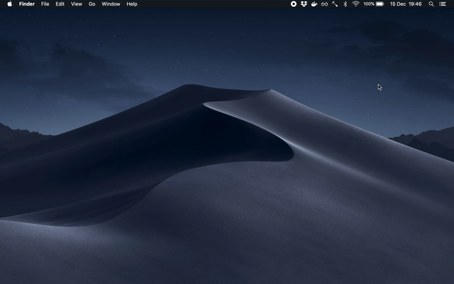

# PassChooser

macOS UI for selecting and copying password into clipboard



## Installation

- Make sure [`pass`](https://www.passwordstore.org/) command works in the terminal

- Install [Hammerspoon](http://www.hammerspoon.org/)

- Install `PassChooser.spoon`
    - Download [the `.zip`](https://github.com/daGrevis/PassChooser.spoon/archive/master.zip), uncompress it and double-click on the Spoon
    - ...or clone the repo and move it to `~/.hammerspoon/Spoons/`

- Load and configure the Spoon via `~/.hammerspoon/init.lua`

```lua
local PassChooser = hs.loadSpoon('PassChooser')
PassChooser:bindHotkeys({
  show={{'cmd'}, 'p'},
})
```

- Reload Hammerspoon
